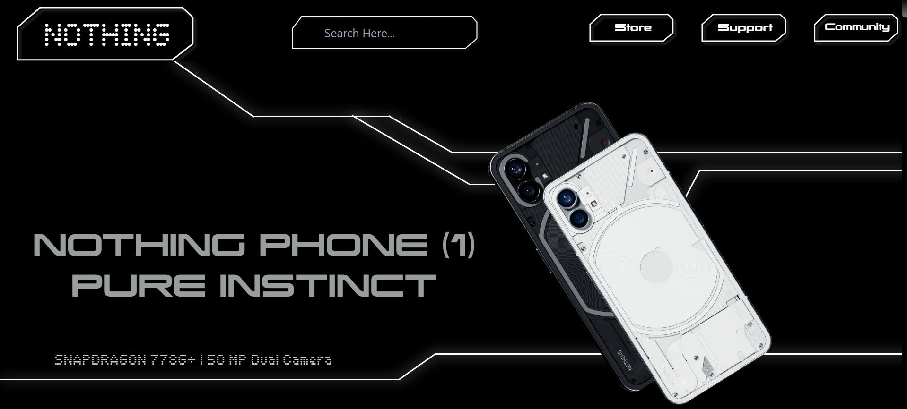
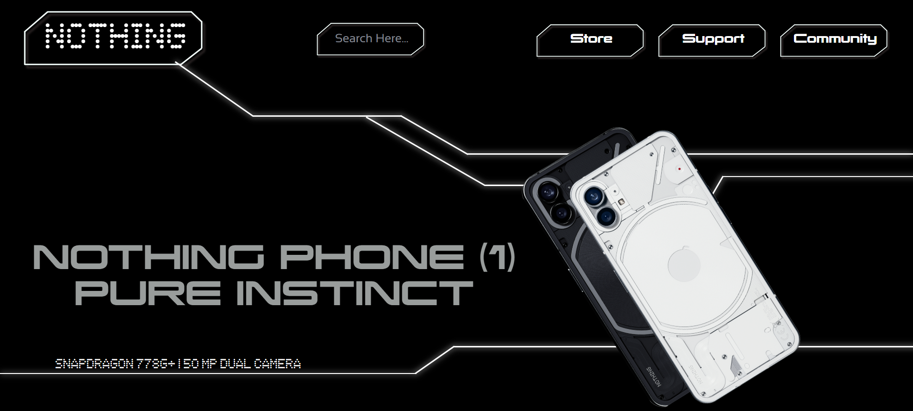

# 🚀 Daily Challenge 2 - Sheryians Coding School  

## 🧠 Challenge Overview
This project was created as part of **Daily Challenge 2** under **Cohort 2.0**.  
The task was to recreate a **modern, minimalist webpage** inspired by the **NOTHING PHONE (1)** using only **HTML** and **CSS**.

## 🌐 Project Preview
A visually minimal and tech-themed webpage featuring:
- Clean **black-and-white** layout  
- **Custom typography** embedded using `@font-face`  
- **Angled phone images** for a modern touch  
- **Simple white line accents** for visual structure  
- Centered and balanced design reflecting the Nothing brand style

## 🖼️ Image Comparison
Two images were used to show the design process and results:

| Image | Description |
|--------|--------------|
|  | **original.png** — the reference image taken as the base inspiration. |
|  | **mine.png** — my recreated version built completely with HTML and CSS. |

## ✨ Features  
| Feature | Description |
|----------|-------------|
| **Custom Font Integration** | Used unique fonts to replicate the Nothing brand aesthetic |
| **Responsive Layout** | Maintains alignment and design across different screen sizes |
| **Modern Design** | Achieves a clean, futuristic look using minimal elements |
| **Image Positioning** | Perfectly angled device visuals for dynamic composition |
| **Visual Line Accent** | Thin white lines to create separation and highlight key areas |

## 🛠️ Technologies Used  
- **HTML5** for page structure and content  
- **CSS3** for styling and visual layout  
- **Custom Fonts** to replicate the brand-style typography  

## 📖 Learning Outcome  
By completing this task, I strengthened my **CSS positioning skills**, practiced working with **custom fonts**, and learned to combine **typography and imagery** for a clean, **fashion-style landing page design**.  

## 🙌 Acknowledgement  
This task was completed as part of **Sheryians Coding School Cohort 2.0**.  

---